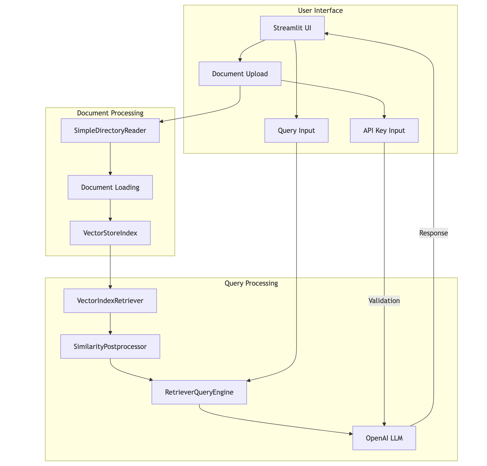
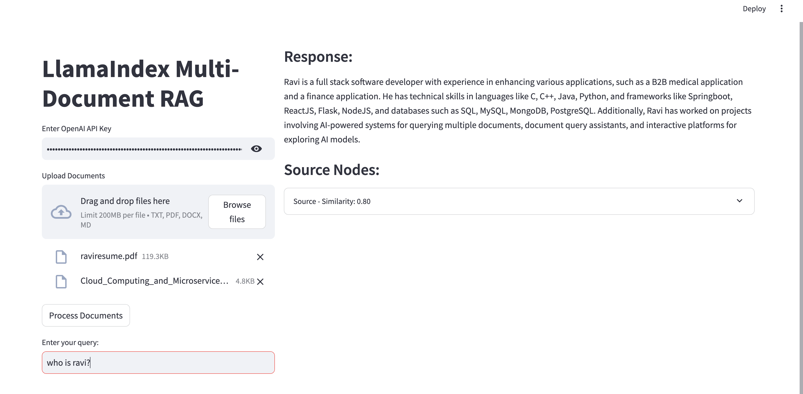

# LlamaIndex Multi-Document RAG Application

A Streamlit-based RAG (Retrieval-Augmented Generation) application for processing and querying multiple documents using LlamaIndex and OpenAI.

## Project Architecture



## Quick Start

```bash
# Clone the repository
git clone https://github.com/ravix007/multi-doc-llamaindex-rag.git
cd multi-doc-llamaindex-rag

# Create virtual environment
python -m venv venv
source venv/bin/activate  # On Windows: venv\Scripts\activate

# Install dependencies
pip install -r requirements.txt

# Create .env file
echo "OPENAI_API_KEY=your_api_key_here" > .env

# Run the application
streamlit run app.py
```

## Project Structure

```
llamaindex-rag/
├── app.py               # Main Streamlit application
├── requirements.txt     # Project dependencies
├── .env                # Environment variables
└── README.md           # Documentation
```

## Dependencies

```python
streamlit
llama-index
python-dotenv
openai
```

## Features

- **Document Support**

  - Upload multiple documents (txt, pdf, docx, md)
  - Automatic document processing and indexing
  - Vector-based document storage

- **Query Processing**

  - Similarity-based retrieval
  - Post-processing with configurable thresholds
  - Source tracking and similarity scores

- **User Interface**
  - Split-panel layout
  - Progress indicators
  - Error handling
  - Source visualization

## Configuration

```python
# config.py
SETTINGS = {
    "similarity_cutoff": 0.75,
    "top_k": 4,
    "temperature": 0,
    "model": "gpt-3.5-turbo"
}
```

## Usage

1. **Start the Application**

   ```bash
   streamlit run app.py
   ```

2. **API Key Setup**

   - Enter your OpenAI API key in the sidebar
   - Key is securely stored in session state

3. **Document Processing**

   ```python
   # Upload documents
   documents = st.file_uploader("Upload Documents", accept_multiple_files=True)

   # Process and index
   if st.button("Process Documents"):
       index = create_index(documents)
   ```

4. **Querying**

   ```python
   # Enter query
   query = st.text_input("Enter your question:")

   # Get response
   if query:
       response = query_engine.query(query)
   ```

## API Reference

### Document Processing

```python
def load_documents_from_files(uploaded_files):
    """
    Load and process uploaded documents

    Args:
        uploaded_files: List of StreamlitUploadedFiles

    Returns:
        List[Document]: Processed documents
    """
```

### Indexing

```python
def create_index(documents):
    """
    Create vector store index

    Args:
        documents: List of processed documents

    Returns:
        VectorStoreIndex: Document index
    """
```

### Query Engine

```python
def create_query_engine(index):
    """
    Initialize query engine with retriever and postprocessor

    Args:
        index: VectorStoreIndex

    Returns:
        RetrieverQueryEngine: Configured query engine
    """
```

## Error Handling

The application includes comprehensive error handling:

```python
try:
    # Process documents
    documents = load_documents_from_files(uploaded_files)
    index = create_index(documents)
    query_engine = create_query_engine(index)
except Exception as e:
    st.error(f"Error: {str(e)}")
    logger.error(f"Processing error: {str(e)}")
```

## Logging

```python
# Configure logging
logging.basicConfig(
    level=logging.INFO,
    format='%(asctime)s - %(name)s - %(levelname)s - %(message)s'
)
```

## Screenshot of working project


